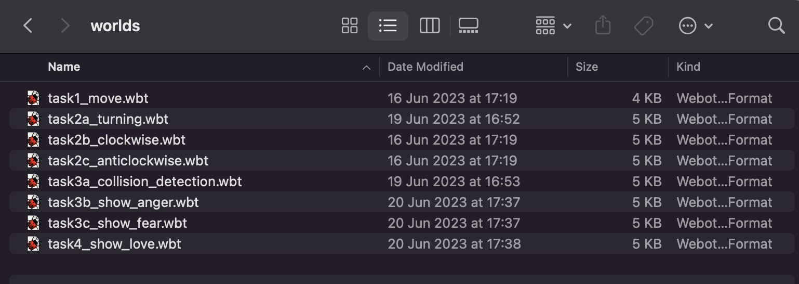
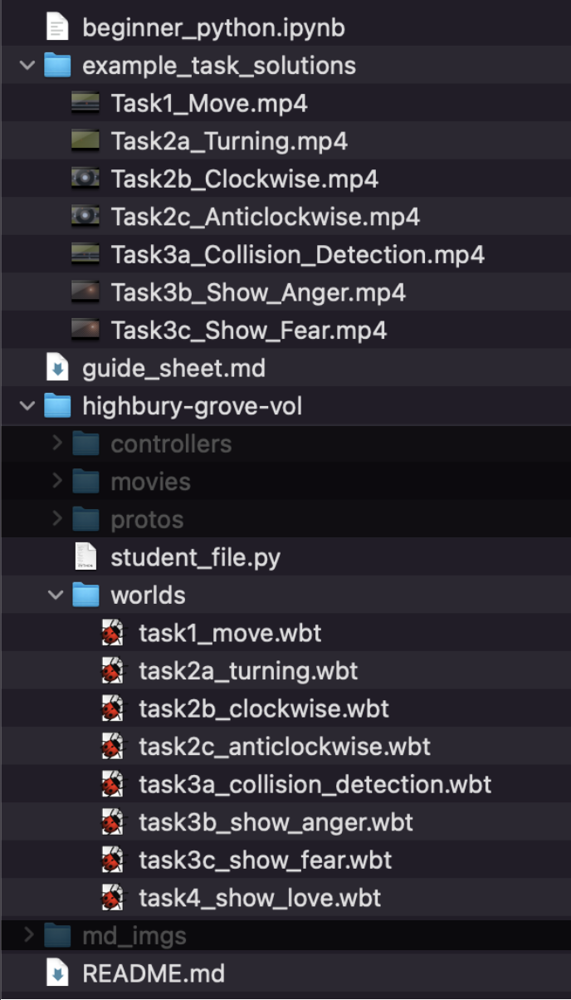
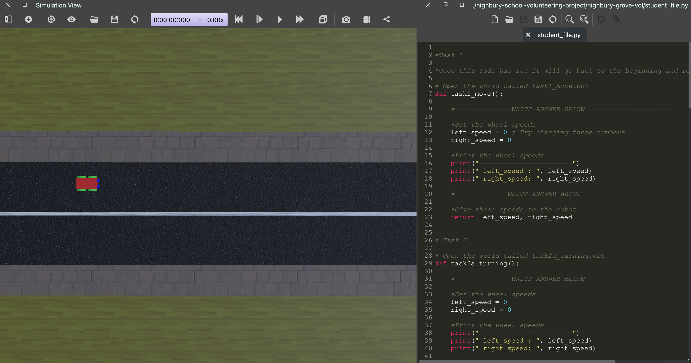
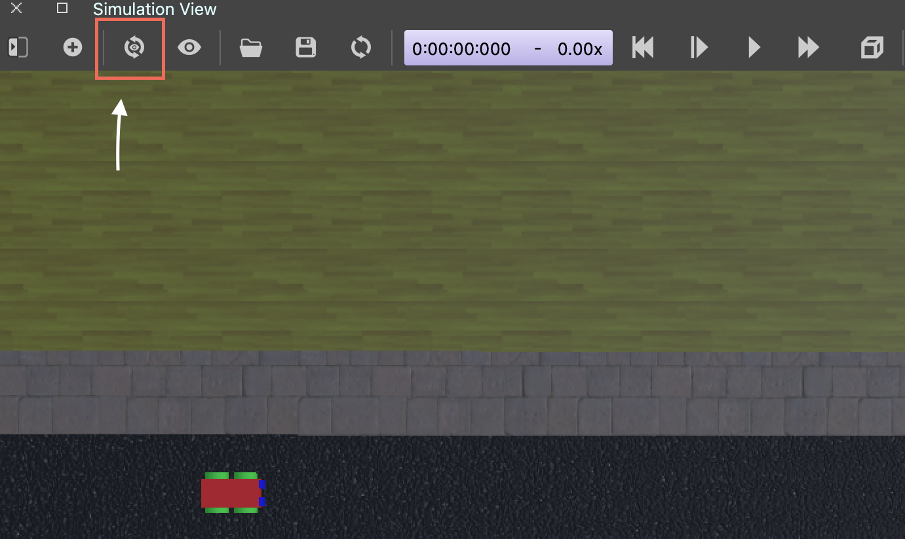

# Intro to the folders
Every task has its own function and world.
At the start of each task, you should load the world for that task. 
To do this, in the Webots program, do:

`File -> Open World -> [pick the world with the right task number]`

If you don't see the worlds, they should be in the following folder:
highbury-school-volunteering-project -> highbury-grove-vol -> worlds

The folder structure looks like this: 

 

You don't need to worry about a lot of these folders. The files below are the only ones that you need to interact with.
- `example_task_solutions` contains videos for what each task result should look like. 
- `highbury-grove-vol/worlds` contains each world you need to load for each individual task
- `highbury-grove-student_file.py` is the file that you will write your solutions to each task in
- `beginner_python.ipynb` is the file containing helpful Python hints and how to get started with coding
- `guide_sheet.md` is an overview of the project
- `README.md` is this file! 

# Webots
When you open Webots, this is the view you should get.
 

 
On the right hand side of the program is where the Python code is kept. This `student_file.py` is what moves the robot and will be what you should change to complete the tasks. If this file isnt there, or you accidently close it, you can reopen it by doing:

`Tools -> Text Editor`

The file is located in this location:

`highbury-school-volunteering-project -> highbury-grove-vol -> student_file.py`

If you accidently change the view of the camera in the world, you can easily get it back by doing: 

`Control + Shift + V`

Or by hitting the button on the program with arrows circling an eye.

 
Finally, make sure not to hit 'Save World' as this will overwrite the world that you are using. To make sure this doesnt happen, make a copy of the folder and store it somewhere else and then you can replace it if you change anything accidently. 

# Install packages and Webots
`pip install controller`
- Download Webots from `https://cyberbotics.com/`

# Task 1 - Moving
- Get the robot to move in a straight line.
- How could you get it to go at a different speed?

 
<video controls> <source src="example_task_solutions/Task1_Move.mp4" type="video/mp4"> </video>

 

# Task 2a - Turning
- Get the robot to move in a circle
- Is there a way that you can change the size of the circle?
- How about making it go the other way around?

 
<video controls> <source src="example_task_solutions/Task2a_Turning.mp4" type="video/mp4"> </video>

 

# Task 2b - Turning clockwise
- Now can you make the robot turn clockwise whilst staying on the rounabout road?

 
<video controls> <source src="example_task_solutions/Task2b_Clockwise.mp4" type="video/mp4"> </video>

 

# Task 2c - Turning anticlockwise
- How about turning on the roundabout in an anticlockwise circle?

 
<video controls> <source src="example_task_solutions/Task2c_Anticlockwise.mp4" type="video/mp4"> </video>

 

# Task 3a - Collision Detection
- Now we introduce a type of sensor onto the robot. They are called distance sensors and there are two located on the front face of the robot. They are named 'ds_left' and 'ds_right'. When printing out the values of these sensors they will always output 10 until they get close to an obstacle. Then the values will start to decrease.

- Can you get the robot to stop before it hits the crash barrier?
(you may need to use an if statement)
- How would you get it to stop at a different point to the barrier? (i.e. closer or farther away)
- Think about how this could be applied to real-life

 
<video controls> <source src="example_task_solutions/Task3a_Collision_Detection.mp4" type="video/mp4"> </video>

 

# Task 3b - Show anger
- There is a new sensor! Now we are introducing a light sensor. This is similar to the distance sensor, there are two of them (i.e a left and right) in the same location as the distance sensors and their values range between 0 and 10. The more light they detect the higher the value the sensor outputs. 
- There are now lights on the robot arena. They have no physical presence, so the distance sensors will not be able to detect them.
- Here is the code we came up with for the robot to use the light and show anger
- How might you have done differently?
- Can you see how the robot is using the light sensors?

 
<video controls> <source src="example_task_solutions/Task3b_Show_Anger.mp4" type="video/mp4"> </video>

 

# Task 3c - show fear
- Now we give out interpretation of how a robot might display fear
- What would you do, would you do it similarly or in a different way to us?

 
<video controls> <source src="example_task_solutions/Task3c_Show_Fear.mp4" type="video/mp4"> </video>

 

# Task 4 - Show love
- Now it is your turn.
- Use the light sensors and try and get the robot to show love

# Task 5 - Research and Present Your Findings
1. Research the applications of this technology
- One interesting fact about automated vehicles
- Any pro’s and con’s - think about the environment, accessibility for everyone in society, costs, road accidents

2. Near future applications on this type of technology
- Check out this videos on AI and Robotics:
  https://www.youtube.com/watch?v=yCXm5cgG0UA
- Meet the AI Robot capable of Human Emotion:
  https://www.youtube.com/watch?v=wGWVKkYEHBE
- How do you think this technology will change our world?
- Do you think it will have a positive or negative impact on society, and why?  

3. What can you imagine we could use this type of technology for in 100 years
- Think about how it’s being used now, how it’s planned on being in the future, and what you would do differently
- How could it improve the world we live in?  
